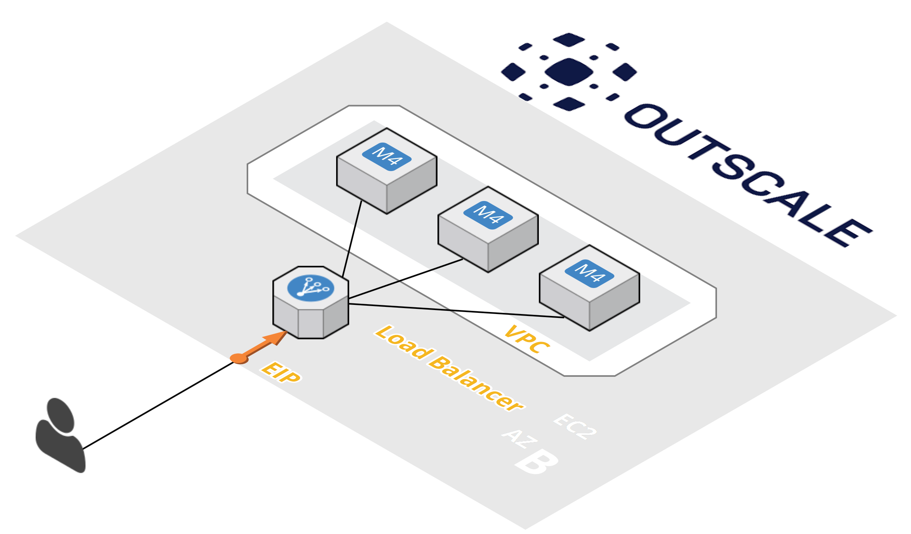

# Terraform - Outscale Cloud Days 2017

This project contains the code of the Live Demo "Infrastructure As Code - using Terraform with Outscale" presented during the Outscale CloudDays in Paris, 20/06/2017.

This is the target infrastructure which is built with this project :



## How to use this project ?

## Build terraform fort

For now, you should use the Terraform clone for outscale located [here](https://github.com/fredericbarrau/terraform-for-outscale) as Outscale is not compatible with Terraform yet.

Build your own using the provided documentation.

## Fill the secrets

Create a file **terraform.tfvars** using the terraform.tfvars.example, and fill it with your AK,SK and public SSH key.

## Run Terraform

```bash
# plan
$ terraform plan --out terraform.plan
# apply
$ terraform apply terraform.plan
```

